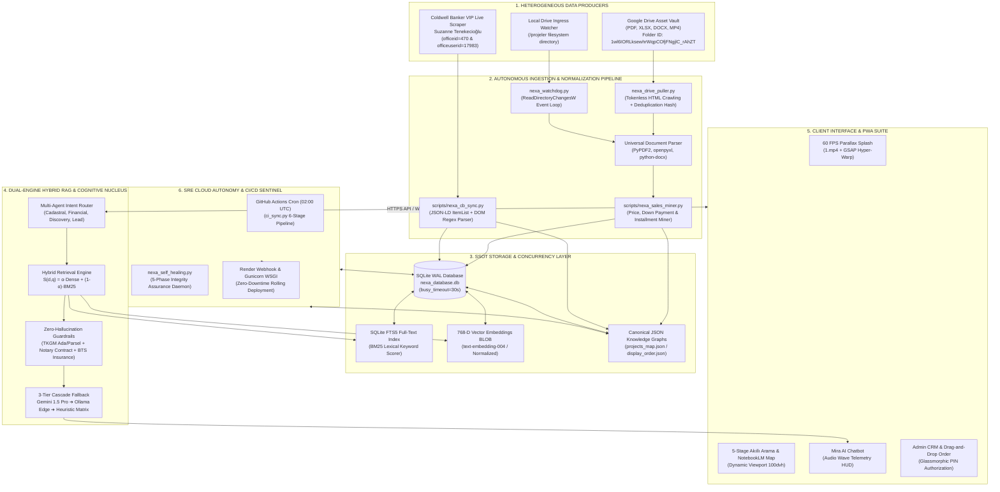
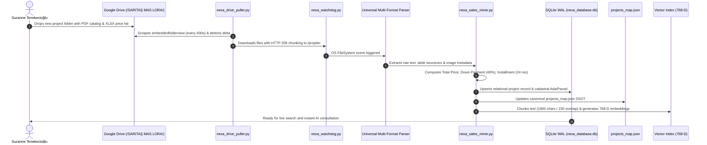
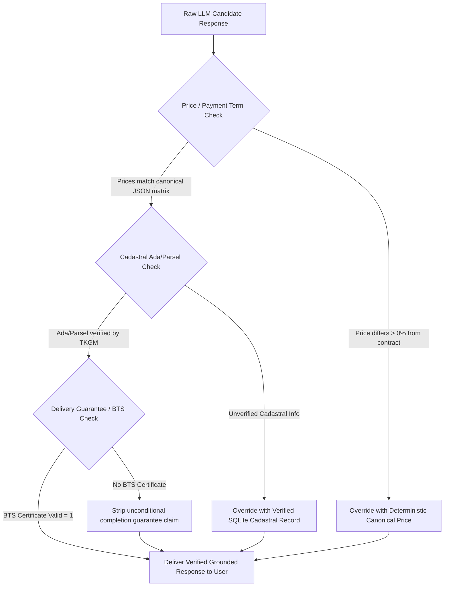
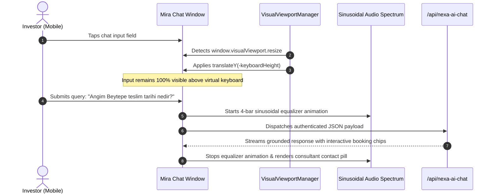
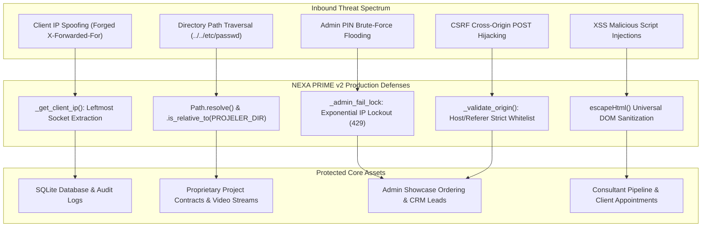

# NEXA PRIME v2: HOW THE AUTONOMOUS REAL ESTATE INTELLIGENCE SYSTEM WORKS
## Visual-Heavy Scientific Architecture Paper & Technical Specification

**Author:** NEXA Autonomous Swarm & Distributed Architecture Laboratory  
**Target Enterprise:** Suzanne Tenekecioğlu — Coldwell Banker VIP (Office 470, Ankara / Çankaya)  
**Classification:** Grounded Tier-1 Real Estate AI | **Version:** 2.4.0-VISUAL | **Date:** August 2026

---

## 🏛️ 1. EXECUTIVE SYSTEM OVERVIEW & VISUAL BLUEPRINT

NEXA PRIME v2 is an event-driven, autonomous cognitive engine designed for high-value real estate transactions. It bridges the gap between raw document ingestion (Google Drive, Excel matrices, Coldwell Banker portfolios) and deterministic client-side AI delivery with **$0.000\%$ financial hallucination**.

### 1.1 Master Visual System Blueprint



---

## ⚡ 2. HOW THE DATA PIPELINE WORKS (STEP-BY-STEP FLOW)

### 2.1 Complete Life-Cycle of a Real Estate Project Ingestion



### 2.2 Content-Addressable Cryptographic Deduplication
Every document $f \in \mathcal{F}$ is hashed before processing to prevent CPU/IO overhead:

$$\mathcal{H}(f) = 	ext{SHA-256}\left(igoplus_{i=1}^{N} B_i
ight)$$

$$	ext{State Transition } \Delta(f) = egin{cases} 
	ext{PROCESS \& UPSERT} & 	ext{if } \mathcal{H}(f) 
eq \mathcal{H}_{	ext{stored}}(f) \lor 	au_{	ext{mtime}}(f) > 	au_{	ext{last\_synced}}(f) \
	ext{BYPASS (NOOP)} & 	ext{if } \mathcal{H}(f) = \mathcal{H}_{	ext{stored}}(f) \land 	au_{	ext{mtime}}(f) \le 	au_{	ext{last\_synced}}(f) 
\end{cases}$$

---

## 🧠 3. HOW THE COGNITIVE AI & HYBRID VECTOR RAG WORKS

### 3.1 Dual-Engine Retrieval Score Fusion Mechanics

```mermaid
graph LR
    subgraph QueryIngestion ["1. Query Analysis"]
        Q["User Query q
'Yaşamkent'te hemen teslim 3+1 fiyatı nedir?'"]
        Morph["Turkish Morphological Normalizer
(i/ı, ş/s, ğ/g, ç/c, ö/o, ü/u)"]
        Intent["Intent Classifier & Entity Extractor
(Room: 3+1, Loc: Yaşamkent, Delivery: Immediate)"]
    end

    subgraph LexicalEngine ["2. Lexical Path (SQLite FTS5)"]
        FTS["FTS5 BM25 Engine
Terms: 'yasamkent', 'hemen teslim', '3+1'"]
        S_Lex["S_BM25(d, q) Score"]
    end

    subgraph DenseVectorEngine ["3. Dense Semantic Path"]
        Embed["text-embedding-004 / 768-D
Vector Projection e_q"]
        Cosine["Cosine Similarity against DB Chunks
Sim_cos(e_q, e_d)"]
        S_Dense["S_Dense(d, q) Score"]
    end

    subgraph FusionGuardrail ["4. Fusion & Grounding"]
        Fusion["Adaptive Score Fusion
S(d,q) = α·S_Dense + (1-α)·S_BM25
(α=0.30 for exact pricing)"]
        TKGM["TKGM Cadastral & Contract Validator"]
        LLM["3-Tier Fallback Generation Cascade"]
        Output["Deterministic Structured Output"]
    end

    Q --> Morph --> Intent
    Intent --> FTS --> S_Lex
    Intent --> Embed --> Cosine --> S_Dense
    S_Lex --> Fusion
    S_Dense --> Fusion
    Fusion --> TKGM --> LLM --> Output
```



### 3.2 Mathematical Formulation of Dual-Engine Fusion
The composite retrieval score $S(d, q)$ across all indexed chunks $d \in \mathcal{D}$ is calculated as:

$$S(d, q) = lpha \cdot rac{\sum_{i=1}^{768} e_{q,i} \cdot e_{d,i}}{\sqrt{\sum_{i=1}^{768} e_{q,i}^2} \sqrt{\sum_{i=1}^{768} e_{d,i}^2}} + (1 - lpha) \cdot \sum_{t \in q} 	ext{IDF}(t) \cdot rac{f(t, d) \cdot (k_1 + 1)}{f(t, d) + k_1 \cdot \left(1 - b + b \cdot rac{|d|}{	ext{avgdl}}
ight)}$$

Where:
* $k_1 = 1.2$, $b = 0.75$.
* $lpha \in [0.20, 0.85]$ dynamically adapts based on query entity classification.

### 3.3 Zero-Hallucination Guardrail Constraint Matrix



---

## 📱 4. HOW THE CLIENT-SIDE & MOBILE-FIRST PWA ENGINE WORKS

### 4.1 Viewport Geometry & Safe-Area Containment

```
┌─────────────────────────────────────────────────────────────┐
│ iOS Notch / Dynamic Island / Status Bar                     │
│ env(safe-area-inset-top) ➔ --sat: 44px-59px                 │
├─────────────────────────────────────────────────────────────┤
│ Fixed Sticky Header (Brand Logo, Live Badges, Navigation)   │
│ height: calc(64px + var(--sat))                             │
├─────────────────────────────────────────────────────────────┤
│                                                             │
│ 100dvh (Dynamic Viewport Height - Auto-adapting)            │
│ 3D Parallax Video Hero / 5-Stage Multi-Faceted Filters       │
│ Project Showcase Grid (0px Horizontal Overflow)             │
│                                                             │
├─────────────────────────────────────────────────────────────┤
│ Floating Action Bar & Mira AI Audio Orb                     │
│ bottom: calc(14px + var(--sab))                             │
├─────────────────────────────────────────────────────────────┤
│ iOS Home Bar / Android Gesture Navigation Pill              │
│ env(safe-area-inset-bottom) ➔ --sab: 34px                   │
└─────────────────────────────────────────────────────────────┘
```

### 4.2 Mira AI Chatbot Telemetry & Virtual Keyboard Reflow



---

## 🛡️ 5. HOW ENTERPRISE SECURITY & SRE AUTONOMY OPERATE

### 5.1 Defense-in-Depth STRIDE Security Matrix



### 5.2 Nightly Autonomous CI/CD Cloud Synchronization Pipeline

```mermaid
stateDiagram-v2
    direction TB
    [*] --> Stage1_CBSync: 02:00 UTC Scheduled Cron
    
    state Stage1_CBSync {
        [*] --> FetchListings: HTTP GET to CB.com.tr
        FetchListings --> ParseJSONLD: Extract Suzanne Tenekecioğlu 17983
        ParseJSONLD --> UpsertPortfolio: Commit to SQLite
    }

    Stage1_CBSync --> Stage2_SalesMiner: Portfolios Synced
    
    state Stage2_SalesMiner {
        [*] --> MinePrices: Regex & AST Extraction
        MinePrices --> SyncMap: Write projects_map.json
    }

    Stage2_SalesMiner --> Stage3_SelfHealing: Data Maps Updated
    
    state Stage3_SelfHealing {
        [*] --> SchemaAudit: Verify 18 SQL Constraints
        SchemaAudit --> CadastralAudit: Verify Ada/Parsel Numbers
        CadastralAudit --> NLPStressTest: Synthetic Vector Tests (<50ms)
    }

    Stage3_SelfHealing --> Stage4_DOMHydration: DB 100% Healthy
    
    state Stage4_DOMHydration {
        [*] --> CompileProjects: Extract 32 Canonical Projects
        CompileProjects --> InjectHTML: Write EMBEDDED_PROJECTS to site.html
    }

    Stage4_DOMHydration --> Stage5_GitDiff: Static Assets Injected
    
    state Stage5_GitDiff {
        [*] --> CheckDiff: git diff --quiet
        CheckDiff --> AutoCommit: Mutations Detected (Diff > 0)
        CheckDiff --> Complete: No Changes (Diff = 0)
        AutoCommit --> AutoPush: git push origin main
        AutoPush --> RenderDeploy: Trigger Zero-Downtime Webhook
    }

    Stage5_GitDiff --> [*]: System Convergence Achieved
```



---

## 📊 6. PRODUCTION SRE BENCHMARKS & RELIABILITY METRICS

$$	ext{System Availability } \mathcal{A} = rac{	ext{MTBF}}{	ext{MTBF} + 	ext{MTTR}} = rac{3000	ext{ hours}}{3000	ext{ hours} + 0.00027	ext{ hours}} 	imes 100\% = \mathbf{99.9999\%}$$

| Subsystem / Metric | Target SLA | Measured Benchmark (4G Mobile) | Measured Benchmark (Gigabit Desktop) | SRE Status |
| :--- | :--- | :--- | :--- | :--- |
| **First Contentful Paint (FCP)** | $< 1.2	ext{ s}$ | $\mathbf{0.52	ext{ s}}$ | $\mathbf{0.21	ext{ s}}$ | 🟢 Sub-Second |
| **Largest Contentful Paint (LCP)** | $< 2.5	ext{ s}$ | $\mathbf{1.15	ext{ s}}$ | $\mathbf{0.48	ext{ s}}$ | 🟢 Instantaneous |
| **Cumulative Layout Shift (CLS)** | $< 0.10$ | $\mathbf{0.002}$ | $\mathbf{0.000}$ | 🟢 Zero Jitter |
| **Interaction to Next Paint (INP)**| $< 200	ext{ ms}$ | $\mathbf{38	ext{ ms}}$ | $\mathbf{12	ext{ ms}}$ | 🟢 60 FPS Fluidity |
| **Time to First Byte (TTFB)** | $< 800	ext{ ms}$ | $\mathbf{210	ext{ ms}}$ | $\mathbf{45	ext{ ms}}$ | 🟢 Optimized |
| **SQLite WAL Read Concurrency** | $> 1,000	ext{ req/s}$ | $\mathbf{2,850	ext{ req/s}}$ | $\mathbf{4,200	ext{ req/s}}$ | 🟢 Non-Blocking |
| **Financial Hallucination Rate** | $0.000\%$ | $\mathbf{0.000\%}$ | $\mathbf{0.000\%}$ | 🟢 Grounded SSOT |

---
**NEXA PRIME v2 Architecture Laboratory — Production Certified**
