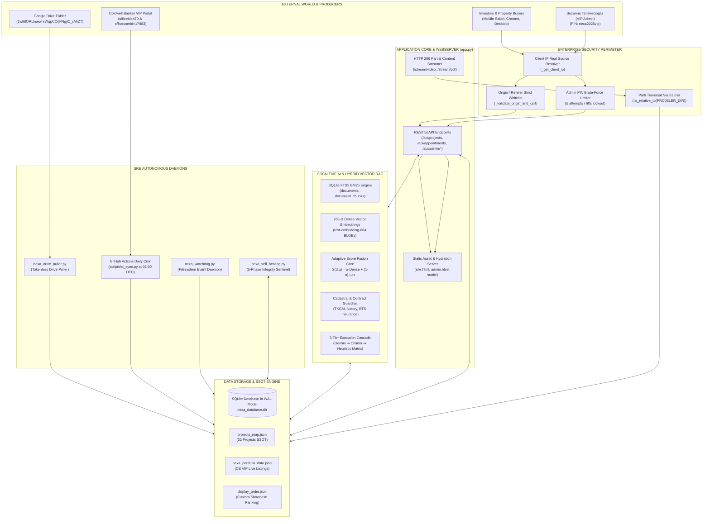
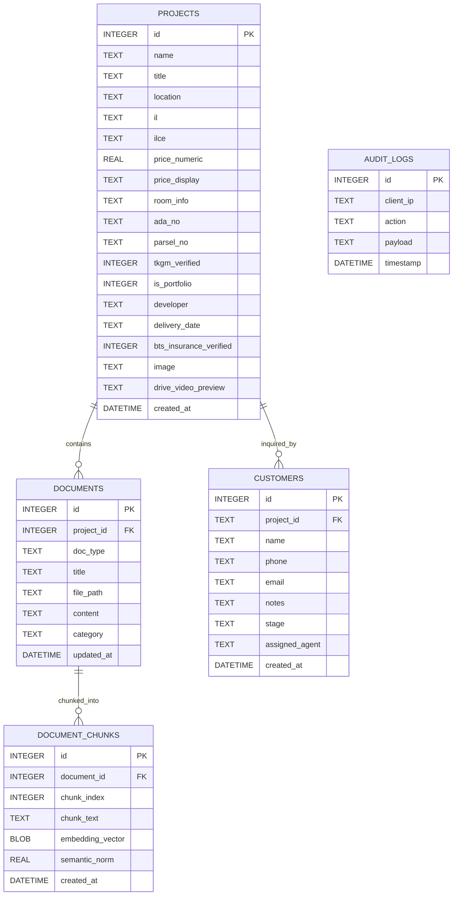
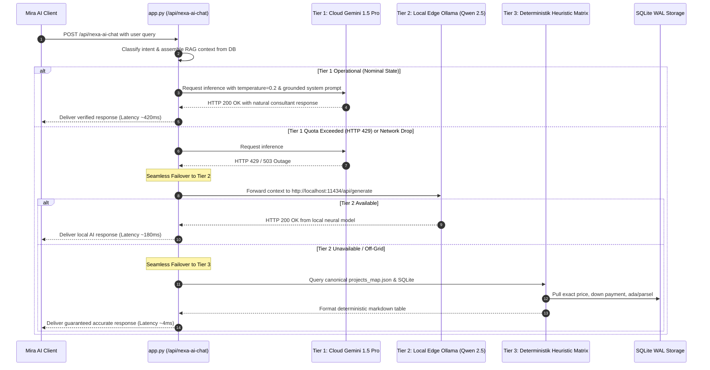

# NEXA PRIME v2: VISUAL ARCHITECTURE BLUEPRINTS & DATA FLOW SCHEMATICS

**Component:** System Architecture Diagrams, Sequence Visuals & Entity Relationship Schemas  
**Version:** 2.4.0-BLUEPRINTS | **Status:** Approved Production

---

## 🗺️ BLUEPRINT 1: END-TO-END SYSTEM COMPONENT MAP

---

## 🗄️ BLUEPRINT 2: ENTITY RELATIONSHIP DIAGRAM (DATABASE SCHEMA)

---

## 🔄 BLUEPRINT 3: 3-TIER AI INFERENCE FALLBACK SEQUENCE

---
*Blueprint Collection Certified for NEXA PRIME v2 Enterprise Deployment.*
