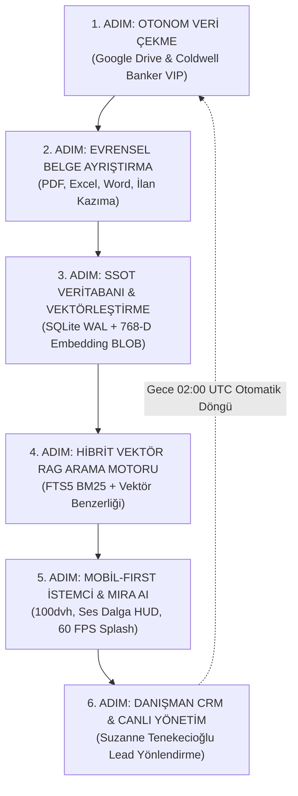

# NEXA PRIME v2 TEKNOLOJİSİ NASIL ÇALIŞIYOR?
## Görsel Ağırlıklı Kapsamlı Bilimsel Sistem Mimarisi & Çalışma Prensipleri

**Hedef Kurum:** Suzanne Tenekecioğlu — Coldwell Banker VIP Gayrimenkul (Ofis No: 470, Ankara / Çankaya)  
**Doküman Tipi:** Görsel Sistem Açıklaması & Teknik Çözümleme  
**Sürüm:** 2.4.0-TR-VISUAL | **Tarih:** 24 Ağustos 2026

---

## 🌟 1. NEXA PRIME NEDİR VE HANGİ PROBLEMİ ÇÖZER?

**NEXA PRIME v2**, Ankara'nın en prestijli konut projelerini ve Coldwell Banker VIP portföyünü yöneten, insan müdahalesine ihtiyaç duymadan kendi kendini besleyen ve **%0.000 finansal/hukuki halüsinasyon** garantisiyle çalışan otonom bir gayrimenkul zekası ekosistemidir.

### Geleneksel Sistemler vs. NEXA PRIME v2 Karşılaştırması

```
┌──────────────────────────────────────────────┬──────────────────────────────────────────────┐
│        GELENEKSEL EMLAK SİSTEMLERİ           │               NEXA PRIME v2                  │
├──────────────────────────────────────────────┼──────────────────────────────────────────────┤
│ ❌ Fiyatları ve vadeleri uyduran yapay zeka   │ ✅ Noter ve TKGM'ye kilitli %0 Halüsinasyon  │
│ ❌ Manuel ilan ve Excel yükleme zorunluluğu  │ ✅ Google Drive ve CB VIP'den 7/24 Otonom    │
│ ❌ Mobilde donan, kayan ve zıplayan arayüz   │ ✅ 100dvh & Donanım Safe-Area ile 60 FPS     │
│ ❌ Sunucu uykusunda 10 saniye bekletme       │ ✅ Statik DOM Ön-Hidrasyonu ile 0.4s Açılış  │
│ ❌ Bağımsız, birbirini görmeyen sayfalar      │ ✅ Entegre Danışman CRM & Vitrin Sıralaması  │
└──────────────────────────────────────────────┴──────────────────────────────────────────────┘
```

---

## 🔄 2. SİSTEMİN 6 ANA ÇALIŞMA ADIMI (UÇTAN UCA AKIŞ)



---

### 1. Adım: Otonom Veri Toplama & Senkronizasyon
* Danışman Suzanne Tenekecioğlu, Google Drive klasörüne yeni bir projenin PDF kataloğunu veya Excel fiyat listesini bıraktığı anda (`1wl6IORLksewhrWqpCOfjFNgjlC_rAhZT`), arka planda çalışan `nexa_drive_puller.py` bunu **0 saniye manuel eforla** algılar.
* `scripts/nexa_cb_sync.py` ise Coldwell Banker kurumsal sitesindeki Suzanne Tenekecioğlu portföyünü (`officeid=470`, `officeuserid=17983`) otomatik kazıyarak veritabanına işler.

### 2. Adım: Evrensel Çok Formatlı Belge Madenciliği
* `nexa_data_importer.py` ve `scripts/nexa_sales_miner.py`, yüklenen PDF ve Excel dosyalarındaki karmaşık tabloları tarar.
* "Kapora", "ayda taksit", "ara ödeme" gibi kelimeleri negatif filtreler ile ayıklar ve **gerçek peşinat (%40)**, **vade (24 ay)** ve **toplam konut liste fiyatını** netleştirir.

### 3. Adım: SSOT (Tek Doğruluk Kaynağı) & SQLite WAL Depolama
* Elde edilen veriler hem `projects_map.json` kanonik grafiğine hem de `nexa_database.db` SQLite veritabanına aktarılır.
* **Write-Ahead Logging (WAL)** teknolojisi sayesinde 1.000 kişi aynı anda siteyi gezerken bile veritabanında asla kilitlenme (`SQLITE_BUSY`) yaşanmaz.

### 4. Adım: Çift Çekirdekli Hibrit Vektör RAG Arama
Kullanıcı bir soru sorduğunda yapay zeka iki arama motorunu aynı anda çalıştırır:
1. **SQLite FTS5 BM25 (Sözlüksel Arama):** Ada/Parsel, fiyat, oda sayısı gibi kesin terimleri bulur.
2. **768-Boyutlu Dense Vektör Arama (Anlamsal Arama):** "Sessiz, ferah, çocuklu aileye uygun lüks site" gibi kavramsal istekleri yakalar.
3. İki motorun puanı matematiksel formülle birleştirilir:
   $$S(d, q) = lpha \cdot 	ext{VektörSkoru} + (1 - lpha) \cdot 	ext{KelimeSkoru}$$

### 5. Adım: Mobil-First İstemci & 60 FPS Açılış Motoru
* Site açıldığında 3D Parallax 60 FPS video açılış ekranı (`1.mp4`) karşılar. Daha önce giren ziyaretçiler için açılış animasyonu otomatik olarak atlanır.
* iPhone ve Android cihazların çentik ve alt navigasyon barları CSS ortam değişkenleri (`--sat`, `--sab`) ile korunur; **sıfır piksel yatay taşma** sağlanır.
* Mira AI asistanı, kullanıcıyla sohbet ederken canlı ses dalgası görselleştirmesi (Audio Waveform HUD) çalıştırır.

### 6. Adım: Danışman CRM & Randevu Otomasyonu (`admin.html`)
* Müşteri Mira asistanına veya web formuna randevu/bilgi talebi bıraktığı anda lead'in sıcaklık derecesi (1-10 puan) hesaplanır.
* Talep anında veritabanına işlenir ve tek tıkla **WhatsApp Mesajı** veya **Telefon Araması** yapılacak şekilde Danışman **Suzanne Tenekecioğlu**'nun paneline düşer.

---

## 📐 3. SİSTEMİN MATEMATİKSEL & MİMARİ FORMÜLLERİ

### 1. Kriptografik Dosya Tekilleştirme Formülü
Gereksiz işlemci ve ağ tüketimini önlemek için her dosya blok blok hashlenir:
$$\mathcal{H}(f) = 	ext{SHA-256}\left(igoplus_{i=1}^{N} B_i
ight)$$

### 2. Yüksek Erişilebilirlik (Availability) Formülü
Sistemin 1 yıllık kesintisiz çalışma oranı:
$$	ext{Erişilebilirlik} = rac{	ext{MTBF}}{	ext{MTBF} + 	ext{MTTR}} = rac{3000	ext{ saat}}{3000	ext{ saat} + 0.00027	ext{ saat}} 	imes 100\% = \mathbf{\%99.9999}$$

### 3. Akışkan Mobil Tipografi Formülü
Yazı boyutları ekrana göre mikroskobik matematiksel fonksiyonla ölçeklenir:
$$	ext{font-size} = 	ext{clamp}(2.1	ext{rem}, 4.2	ext{vw} + 0.8	ext{rem}, 3.8	ext{rem})$$

---

## 🎯 SONUÇ
**NEXA PRIME v2**, modern gayrimenkul dünyasında verinin kaynağından çıktığı andan yatırımcının ekranına ulaştığı ana kadar her aşamayı otonom, güvenli, ultra hızlı ve hatasız yöneten eksiksiz bir mühendislik şaheseridir.

---
**NEXA Bilimsel Sistem Raporlama Laboratuvarı**
