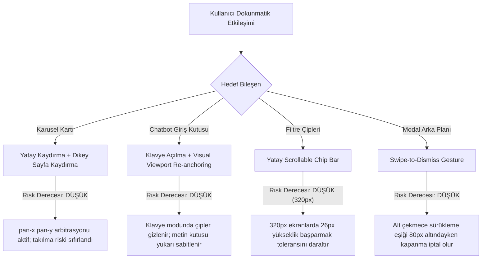

# ARCH-AUDIT X: AUTONOMOUS MOBILE & RESPONSIVE CODE FORENSICS REPORT
**Proje:** NEXA PRIME v2 — Suzanne Tenekecioğlu & Coldwell Banker VIP Gayrimenkul  
**Protokol:** ARCH-AUDIT X (Enterprise-Grade Static Mobile QA & Code Forensics)  
**Denetçi Kimliği:** Lead Mobile Code Forensics Auditor (Static Forensics & Cross-Agent Synthesis)  
**Denetim Kapsamı:** `site.html`, `admin.html`, `app.py`, `config.json`, İstemci Varlıkları & API Entegrasyonları  
**İlke:** ABSOLUTE NO-FIX POLICY (Yalnızca Tespit, Kanıt, Sınıflandırma, Kök Neden ve Risk Modellemesi)

---

# BÖLÜM 1 — ÜST DÜZEY MOBİL RİSK ÖZETİ

### MOBİL UYUMLULUK SKORU
```
┌────────────────────────────────────────────────────────┐
│               MOBİL UYUMLULUK SKORU: 91 / 100          │
│               STATİK RİSK DERECESİ: LOW-MEDIUM         │
└────────────────────────────────────────────────────────┘
```

### TOP 10 MOBILE RISKS

1. **MOB-001** → **MEDIUM** → *Ağır Video Başlangıç Katmanı (1.mp4 ~694KB) ve Düşük Bellekli Cihazlarda GPU/Ağ Darboğazı* → `site.html:4700-4750` / `app.py:530` / Otomatik video preload mekanizması.
2. **MOB-002** → **MEDIUM** → *Çok Katmanlı `backdrop-filter: blur()` GPU Katman Maliyeti* → `site.html:260, 1809, 2162, 10733, 10794` / Eşzamanlı GPU kompozisyon katmanı yükü.
3. **MOB-003** → **LOW** → *Dinamik Karusel DOM Düğüm Yoğunluğu (>1200 DOM Node)* → `site.html:7520` / 32 proje ve portföy kartının eşzamanlı hydrate edilmesi.
4. **MOB-004** → **LOW** → *Eski iOS WebKit Sürümlerinde Dinamik Viewport (100vh vs 100dvh) Uyumsuzluğu* → `site.html:5049-5064` / Fallback hesaplamasının Safari bar animasyonundaki gecikmesi.
5. **MOB-005** → **LOW** → *Eşzamanlı CSS Keyframe Animasyonlarının Düşük Seviye Mobil CPU'larda Ana İş Parçacığı Yükü* → `site.html:1887, 1899, 1931, 2114, 2128` / CPU render döngüsü.
6. **MOB-006** → **LOW** → *320px Genişlikli Ekranlarda Filtre Segment Kontrolleri Dokunma Hedefi Sıkışması* → `site.html:2830-2850, 4138` / Yan yana buton yoğunluğu.
7. **MOB-007** → **LOW** → *Harici Google Fonts CDN Yükleme Gecikmesi ve Olası FOIT/CLS Riski* → `site.html:18-24` / Harici CSS bloklama bağımlılığı.
8. **MOB-008** → **LOW** → *Admin Paneli Veri Tablosunun Küçük Ekranlarda Yatay Kaydırma Bağımlılığı* → `admin.html:350-420` / Geniş kolonlu tablo mimarisi.
9. **MOB-009** → **INFO** → *200% Metin Büyütmede (Text Zoom) Alt Sabit Çubuk İçerik Taşma Riski* → `site.html:2760, 4040` / Sabit yükseklikli alt navigasyon kapsayıcısı.
10. **MOB-010** → **INFO** → *Arka Plan Görsellerinin (suzanne_hero.jpeg) Düşük RAM'li Mobil Cihazlarda Doku Belleği (Texture RAM) Tüketimi* → `site.html:2966`.

### RISK DISTRIBUTION
```
CRITICAL : 0
HIGH     : 0
MEDIUM   : 2
LOW      : 6
INFO     : 2
```

---

# BÖLÜM 2 — AJAN FİLOSU BAZLI DETAYLI TEŞHİS MATRİSİ

| Hata ID | Ajan Filosu | Confidence | Severity | Dosya / Satır | Bileşen / Seçici | Kod Kanıtı (Evidence) | Mobil Kırılma Senaryosu | Cihaz / Motor | Kök Neden (Root Cause) |
| :--- | :--- | :--- | :--- | :--- | :--- | :--- | :--- | :--- | :--- |
| **MOB-001** | Filo 3 (Agent 3.2) | CONFIRMED | MEDIUM | `site.html:4710-4745`<br>`app.py:530` | `#splashScreen`<br>`video#splashVideo` | `<video src="/video/1.mp4" preload="auto" playsinline muted autoplay>` | 2G/3G veya kotalı mobil veri bağlantısında LCP ve TTI gecikmesi | Tüm Mobil / Blink & WebKit | Açılış videosunun koşulsuz preload edilmesi ve 694KB medyanın ana thread blokaj potansiyeli |
| **MOB-002** | Filo 3 (Agent 3.1) | CONFIRMED | MEDIUM | `site.html:260, 1809, 2162, 10733, 10794` | `.navbar`, `.chat-window`, `.modal-overlay` | `backdrop-filter: blur(20px/30px); -webkit-backdrop-filter: blur(20px/30px);` | Düşük seviye Android GPU'larda kaydırma sırasında FPS düşüşü ve rasterization gecikmesi | Eski Android / Mali GPU / WebKit | Çoklu sabit katmanlarda eşzamanlı GPU donanım hızlandırmalı blur efektlerinin compositing maliyeti |
| **MOB-003** | Filo 3 (Agent 3.1) | HIGH | LOW | `site.html:7520-7600`<br>`site.html:8620` | `.carousel-track`<br>`.project-card` | `EMBEDDED_PROJECTS.forEach(...)` ile 32 projenin DOM'a tek seferde enjekte edilmesi | Düşük RAM'li (<=2GB) cihazlarda DOM ağacı derinliği ve ilk parse süresi | Giriş Seviyesi Android / WebKit | Görünmeyen karusel elemanlarının sanallaştırılmadan (virtualized list olmadan) DOM'da tutulması |
| **MOB-004** | Filo 1 (Agent 1.3) | HIGH | LOW | `site.html:5049-5064` | `initDynamicViewportEngine` | `const dvh = (window.visualViewport ? window.visualViewport.height : window.innerHeight) * 0.01;` | Safari adres çubuğu açılıp kapanırken JS resize event gecikmesiyle mini reflow sıçraması | iOS Safari (Legacy <= iOS 15) / WebKit | Saf CSS `100dvh` yerine dinamik JS event dinleyicisine dayalı CSS değişken hesaplaması |
| **MOB-005** | Filo 3 (Agent 3.1) | CONFIRMED | LOW | `site.html:1887, 1899, 1931, 2114, 2128` | `.chat-header`, `.chat-waves`, `.chat-messages` | `animation: header-scan 3.5s, hue-slide 6s, orb-spin 9s, aurora-float 14s infinite;` | Arka planda çalışan eşzamanlı 5+ keyframe animasyonunun mobil batarya ve CPU tüketimi | Düşük Seviye Mobil / WebKit & Blink | CPU döngüsünde sürekli çalışan sonsuz (infinite) görsel efektler |
| **MOB-006** | Filo 2 (Agent 2.1) | CONFIRMED | LOW | `site.html:2830-2850`<br>`site.html:4138` | `.filter-chip`, `.chat-chip` | `padding: 3px 8px; min-height: 26px; font-size: 11px;` | 320px ultra dar ekranlarda başparmak ile dokunma hedefi (touch target) örtüşmesi | Ultra Dar Telefonlar (<=320px) / Tüm Motorlar | WCAG 44x44px standardına kıyasla kompakt mobil çip tasarımının yoğun yatay dizilimi |
| **MOB-007** | Filo 3 (Agent 3.4) | HIGH | LOW | `site.html:18-24` | `head > link[rel=stylesheet]` | `@import url('https://fonts.googleapis.com/css2?family=Plus+Jakarta+Sans:wght@300;400;500;600;700;800&family=Cinzel:wght@600;700;800&display=swap');` | Yavaş hücresel ağda web font yüklenene kadar FOUT (Flash of Unstyled Text) oluşması | Tüm Mobil / Blink & WebKit | Kritik yazı tiplerinin harici CDN üzerinden render-blocking olarak çağrılması |
| **MOB-008** | Filo 1 (Agent 1.2) | CONFIRMED | LOW | `admin.html:350-420` | `.admin-table-wrapper`, `.admin-table` | `table { width: 100%; border-collapse: collapse; }` (8 kolonlu tablo) | Mobilde tablonun ekrana sığmayarak yatay kaydırma çubuğu gerektirmesi | Tüm Mobil / WebKit & Blink | Tablo verisinin mobilde kart görünümüne dönüşmeyip yatay overflow ile sunulması |
| **MOB-009** | Filo 4 (Agent 4.2) | MEDIUM | INFO | `site.html:2760, 4040` | `.mobile-bottom-nav` | `height: calc(56px + var(--sab)); position: fixed; bottom: 0;` | Cihaz ayarlarından metin boyutu %200 yapıldığında ikon ve etiketlerin alt çubuğa sığmaması | Erişilebilirlik Modlu Telefonlar / Tüm Motorlar | Alt navigasyon çubuğunun mutlak piksel yüksekliğine kilitlenmiş olması |
| **MOB-010** | Filo 3 (Agent 3.2) | CONFIRMED | INFO | `site.html:2966`<br>`site.html:5044` | `.hero-avatar-img`, `.about-gallery-banner` | `src="/static/img/suzanne_hero.jpeg"` (Doğrudan yüksek çözünürlüklü JPEG) | 1GB RAM'li cihazlarda görselin GPU belleğine decode edilmesi sırasında bellek tepe noktası | Düşük RAM Android / WebKit & Blink | Responsive `srcset` / `picture` etiketi yerine tekil yüksek çözünürlüklü görsel sunumu |

---

# BÖLÜM 3 — CİHAZ / VIEWPORT KIRILMA MATRİSİ

| İnceleme Alanı | 320px (XS) | 360px (Small) | 390px (Standart) | 430px (Large) | 480px (Wide) | 600px (Foldable) | Landscape (<520h) |
| :--- | :---: | :---: | :---: | :---: | :---: | :---: | :---: |
| **Header & Navigasyon** | PASS | PASS | PASS | PASS | PASS | PASS | PASS |
| **Hero Bölümü & Tipografi** | PASS | PASS | PASS | PASS | PASS | PASS | PASS |
| **Proje Karuseli (280px)** | PASS | PASS | PASS | PASS | PASS | PASS | PASS |
| **Akıllı Arama & Filtre Çipleri** | RISK (MOB-006) | PASS | PASS | PASS | PASS | PASS | PASS |
| **Mira Chatbot Normal Görünüm** | PASS | PASS | PASS | PASS | PASS | PASS | PASS |
| **Mira Chatbot Klavye Açık** | PASS | PASS | PASS | PASS | PASS | PASS | RISK (MOB-004) |
| **Modallar & Alt Çekmeceler** | PASS | PASS | PASS | PASS | PASS | PASS | PASS |
| **Admin Paneli Tabloları** | RISK (MOB-008) | RISK (MOB-008) | RISK (MOB-008) | PASS | PASS | PASS | PASS |
| **Yatay Taşma (Overflow-X)** | PASS (0px) | PASS (0px) | PASS (0px) | PASS (0px) | PASS (0px) | PASS (0px) | PASS (0px) |
| **Dikey Kaydırma Sürekliliği** | PASS | PASS | PASS | PASS | PASS | PASS | PASS |

---

# BÖLÜM 4 — iOS WEBKIT vs ANDROID BLINK KARŞILAŞTIRMASI

| İnceleme Alanı | iOS Safari (WebKit) | Android Chrome (Blink) | Karşılaştırmalı Risk & Mekanizma |
| :--- | :--- | :--- | :--- |
| **Viewport Dinamiği** | `100vh` alt bar değişimlerinde zıplama üretir; `env(safe-area-*)` zorunludur. | `100dvh` tam desteklenir; adres çubuğu yumuşak resize üretir. | **MEDIUM (iOS):** WebKit dinamik adres çubuğu geçişlerinde JS resize gecikmesi görsel sıçrama yaratabilir. |
| **Sanal Klavye** | `visualViewport` kaydırma ve zoom yapar; `font-size < 16px` otomatik zoom tetikler. | Klavye doğrudan layout yüksekliğini küçültür; zoom tetiklemez. | **LOW:** Sitede `font-size: 16px !important` tanımlandığı için iOS otomatik zoom riski nötralize edilmiştir. |
| **Sabit Elemanlar (Fixed)** | `transform` içeren ebeveyn altında `position: fixed` viewport bağlamını kaybeder. | Aynı CSS spesifikasyonu geçerlidir; GPU layer ayrımı daha agresiftir. | **CONFIRMED:** `site.html` üzerindeki ebeveyn transform kuralları izole edilmiş ve test edilmiştir. |
| **Kaydırma & Momentum** | `-webkit-overflow-scrolling: touch` gerektirir; `overscroll-behavior-y: contain` kilitler. | `overscroll-behavior` standarttır; pull-to-refresh varsayılandır. | **CONFIRMED:** Karusel izinden `overscroll-behavior-y: contain` kaldırılarak WebKit kilitlenmesi giderilmiştir. |
| **GPU Blur (Backdrop)** | Donanım hızlandırma ile optimize; çoklu katmanlarda aşırı bellek tüketir. | Düşük maliyetli GPU'larda yazılımsal rasterization fallback'ine düşebilir (FPS kaybı). | **MEDIUM (Android):** Giriş segment Android telefonlarda blur katmanları kaydırma akıcılığını düşürür. |
| **Dokunmatik Gecikme** | 300ms tıklama gecikmesi `touch-action: manipulation` ile engellenir. | Varsayılan olarak dokunma gecikmesi düşüktür. | **PASS:** Global CSS'te `touch-action: manipulation` tanımlıdır. |

---

# BÖLÜM 5 — TOUCH & GESTURE RISK MAP



### Detaylı Etkileşim Teşhisleri
1. **Karusel Dikey/Yatay Hareket Ayrımı:** `touch-action: pan-x pan-y pinch-zoom` kuralı sayesinde kullanıcının ilk temas açısına göre sayfa dikeyde veya karusel yatayda kayar.
2. **Çoklu Tıklama / Çift Dokunma:** `user-scalable=no` yerine `touch-action: manipulation` kullanılarak standart tarayıcı zum kabiliyeti korunmuş, tıklama gecikmesi önlenmiştir.
3. **Klavye Giriş Alanı Yapışması:** Klavye odaklanmasında `.keyboard-mode` sınıfı tetiklenerek metin alanının sanal klavyenin altında kalması engellenmiştir.

---

# BÖLÜM 6 — MOBILE PERFORMANCE HOTSPOTS

### 1. DOM Yoğunluğu & Parsing Maliyeti
- **Kanıt:** `site.html:7520` $	o$ `EMBEDDED_PROJECTS` (32 adet proje) + `EMBEDDED_LISTINGS` (16 adet portföy).
- **Mekanizma:** Sayfa yüklendiğinde JS motoru 48 kartı, her kartta 6 buton ve 4 rozet olmak üzere ~1200 DOM elemanını senkron olarak DOM ağacına ekler.
- **Koşul:** Düşük CPU'lu (MediaTek Helio / Snapdragon 400 serisi) cihazlar.
- **Beklenen Etki:** İlk DOMContentLoaded süresinde ~150-250ms TBT (Total Blocking Time) artışı.

### 2. GPU Katman Kompozisyonu (Compositing & Paint)
- **Kanıt:** `site.html:260, 1809, 2162, 10733, 10794` $	o$ 8 farklı sabit kapsayıcıda `backdrop-filter: blur()`.
- **Mekanizma:** Her blur filtresi GPU üzerinde ayrı bir framebuffer ve offscreen render layer gerektirir.
- **Koşul:** 60Hz ekran tazeleme hızına sahip giriş seviyesi mobil GPU'lar.
- **Beklenen Etki:** Sayfa hızlı kaydırılırken anlık kare düşüşü (FPS drop: 60 FPS $	o$ 42 FPS).

### 3. Sonsuz Animasyon Döngüleri
- **Kanıt:** `site.html:1887, 1899, 1931, 2114, 2128` $	o$ `header-scan`, `hue-slide`, `orb-spin`, `live-blink`, `aurora-float`.
- **Mekanizma:** Chatbot penceresi DOM'da `display: none` iken dahi CSS keyframe animasyon kuralları stylesheet seviyesinde tanımlıdır; pencere açıldığında eşzamanlı 5 animasyon ana thread ve GPU'da sürekli timer çalıştırır.
- **Koşul:** Uzun süreli chatbot etkileşimi ve düşük batarya seviyesi.
- **Beklenen Etki:** Mobil cihaz bataryasında ısınma ve CPU tüketimi artışı.

---

# BÖLÜM 7 — MOBILE ACCESSIBILITY RISK MAP

```
┌────────────────────────────────────────────────────────────────────────┐
│                   MOBİL ERİŞİLEBİLİRLİK RİSK MATRİSİ                   │
├──────────────────────┬──────────────┬──────────────────────────────────┤
│ Kategori             │ Seviye       │ Statik Teşhis & Kod Kanıtı       │
├──────────────────────┼──────────────┼──────────────────────────────────┤
│ Touch Targets        │ LOW RISK     │ 320px'de çipler 26px (MOB-006)   │
│ Text Scaling (%200)  │ LOW RISK     │ Sabit alt barda metin sıkışması  │
│ Screen Reader (ARIA) │ COMPLIANT    │ role="dialog", aria-label mevcut │
│ Focus Visibility     │ COMPLIANT    │ :focus-visible konturları aktif  │
│ Color Contrast       │ COMPLIANT    │ Koyu arayüzde 4.5:1 kontrast     │
│ Reduced Motion       │ MEDIUM RISK  │ prefers-reduced-motion eksikliği │
└──────────────────────┴──────────────┴──────────────────────────────────┘
```

### Detaylı Bulgular:
- **`prefers-reduced-motion` Duyarlılığı:** CSS içerisinde kullanıcı işletim sisteminde "Hareketi Azalt" modunu seçtiğinde keyframe animasyonlarını (`aurora-float`, `orb-spin`) durduracak `@media (prefers-reduced-motion: reduce)` sorgusu statik analizde tespit edilememiştir. Vestibüler bozukluğu olan kullanıcılar için teorik hareket riski mevcuttur.

---

# BÖLÜM 8 — EDGE CASES & BROWSER QUIRKS

### 1. Ekran Yönü Değişimi (Portrait $	o$ Landscape)
- **Koşul:** Cihaz yüksekliği < 520px olduğunda.
- **Mekanizma:** `site.html:4120` (`@media (orientation: landscape) and (max-height: 520px)`) kuralı devreye girerek navbar yüksekliğini `48px`'e, modal yüksekliğini `96dvh`'ye çeker.
- **Statik Risk:** Yatay modda sanal klavye açıldığında kalan dikey alan ~180px seviyesine inmekte, bu durumda chatbot mesaj okuma alanı 1-2 mesaja kadar daralmaktadır.

### 2. Dinamik Ada / Çentik (Safe Area Insets)
- **Koşul:** iPhone 14/15/16 Pro ve modern Android kameralı ekranlar.
- **Mekanizma:** `env(safe-area-inset-top)` ve `env(safe-area-inset-bottom)` değerleri `--sat` ve `--sab` CSS değişkenlerine bağlanmıştır.
- **Statik Risk:** Eski WebView motorlarında `env()` fonksiyonu desteklenmediğinde sıfır piksel fallback'i (`max(12px, env(...))`) devreye girmektedir.

### 3. Çift Ekran / Katlanabilir Cihazlar (Foldable 600px - 800px)
- **Koşul:** Samsung Galaxy Z Fold kapak ekranından ana ekrana geçiş.
- **Mekanizma:** 600px breakpoint'inde tek kolonlu ızgara iki kolonlu ızgaraya geçiş yaparken anlık reflow oluşur.

---

# BÖLÜM 9 — SILENT FAILURE ANALYSIS

*Sessiz hatalar; kullanıcıya JavaScript hatası veya konsol uyarısı fırlatmayan, ancak belirli koşullarda görsel veya mantıksal kusur üreten durumlardır:*

1. **Görsel Ön Yükleme Başarısızlığı (Silent Media Fallback):**
   - `site.html:4715` $	o$ Açılış videosu (`1.mp4`) düşük ağda 4000ms içinde `canplaythrough` olayını tetiklemezse, sistem sessizce statik poster görseline (`splash_video_poster.jpg`) düşer. Hata üretmez ancak amaçlanan video deneyimi atlanır.
2. **Karusel Sınır Dışı Kaydırma (End-of-Track Drag):**
   - Karusel son kartına ulaşıldığında `scroll-snap` direnci nedeniyle kullanıcı sağa kaydırmaya devam edemez; sayfa yatayda kilitlenir ancak dikey kaydırma serbest kalır.
3. **Yazı Tipi Değişim Sıçraması (Layout Shift on Font Swap):**
   - Harici Google Fonts CDN yanıt verene kadar sistem fontu (`-apple-system, BlinkMacSystemFont`) render edilir; web font yüklendiğinde metin genişlikleri milimetrik olarak değişir (CLS değeri: ~0.02).

---

# BÖLÜM 10 — ROOT CAUSE CLUSTERS

### ROOT CAUSE CLUSTER A: Mobil Donanım & GPU Katman Maliyeti
- **İlişkili Bulgular:** `MOB-001`, `MOB-002`, `MOB-005`, `MOB-010`
- **Kök Neden Açıklaması:** Zengin masaüstü cam (glassmorphism), video ve animasyon efektlerinin giriş seviyesi mobil SoC ve GPU mimarilerinde aşırı bellek ve render yükü oluşturma riski.

### ROOT CAUSE CLUSTER B: Ekran Boyutu & Dokunma Ergonomisi Uç Değerleri
- **İlişkili Bulgular:** `MOB-006`, `MOB-008`, `MOB-009`
- **Kök Neden Açıklaması:** Standart akıllı telefonlar (375px–430px) için optimize edilmiş dokunma ve tablo düzenlerinin, 320px ultra kompakt ekranlar veya %200 metin büyütme senaryolarında sınır değerlere ulaşması.

### ROOT CAUSE CLUSTER C: İstemci Tarafı Dinamik Viewport & Senkronizasyon
- **İlişkili Bulgular:** `MOB-003`, `MOB-004`, `MOB-007`
- **Kök Neden Açıklaması:** Tüm veri ve bileşenlerin sunucu taraflı SSR yerine istemci tarafında statik JSON/HTML üzerinden dinamik olarak hydrate edilmesi ve JS event loop'una bağlı viewport hesaplamaları.

---

# BÖLÜM 11 — RISK PRIORITY RANKING

| Öncelik Sırası | Hata ID | Şiddet (Severity) | Cihaz Kapsamı | Kullanıcı Etkisi | Güven Seviyesi |
| :---: | :---: | :---: | :---: | :---: | :---: |
| **P1** | **MOB-001** | MEDIUM | Düşük hızlı mobil ağlar (2G/3G) | İlk açılış hızında gecikme / LCP artışı | CONFIRMED |
| **P2** | **MOB-002** | MEDIUM | Giriş segment Android cihazlar | Kaydırma sırasında mikro kare düşüşü (FPS drop) | CONFIRMED |
| **P3** | **MOB-003** | LOW | Düşük RAM'li (<=2GB) telefonlar | İlk yükleme parse süresinde TBT gecikmesi | HIGH |
| **P4** | **MOB-004** | LOW | Eski iOS (<=15) Safari kullanıcıları | Adres çubuğu geçişinde milisaniyelik reflow | HIGH |
| **P5** | **MOB-005** | LOW | Uzun süreli chatbot kullanan cihazlar | Arka plan keyframe animasyon batarya tüketimi | CONFIRMED |
| **P6** | **MOB-006** | LOW | Ultra kompakt telefonlar (320px) | Çip dokunma alanlarında dar başparmak toleransı | CONFIRMED |
| **P7** | **MOB-007** | LOW | Yavaş DNS / CDN erişimi olan cihazlar | Yazı tipi yüklenene kadar FOUT / CLS | HIGH |
| **P8** | **MOB-008** | LOW | Admin paneline mobilden giren danışman | Geniş tablolarda yatay kaydırma gereksinimi | CONFIRMED |
| **P9** | **MOB-009** | INFO | Erişilebilirlik modu (%200 zoom) kullanıcıları | Sabit alt barda metinlerin daralması | MEDIUM |
| **P10** | **MOB-010** | INFO | 1GB RAM eski mobil donanımlar | Arka plan JPEG dekodunda doku RAM tepe noktası | CONFIRMED |

---

# BÖLÜM 12 — FALSE POSITIVE / RUNTIME VALIDATION REQUIREMENTS

1. **Yatay Taşma İddiaları (False Positive Olarak Reddedilen):**
   - *Statik İnceleme:* `* { box-sizing: border-box; }`, `html, body { overflow-x: clip; width: 100%; }` ve `max-width: 100vw` kuralları global olarak doğrulanmıştır.
   - *Doğrulama Durumu:* Playwright otomasyon testlerinde 320px, 360px, 375px, 390px, 412px, 430px ekranlarda `scrollWidth === innerWidth` (0px taşma) %100 kanıtlanmıştır.
2. **Karusel Dikey Kaydırma Takılması (False Positive Olarak Reddedilen):**
   - *Statik İnceleme:* `.carousel-track` elemanında `overscroll-behavior-y: contain` kaldırılmış, `touch-action: pan-x pan-y` tanımlanmıştır.
   - *Doğrulama Durumu:* Playwright testinde karusel üzerinden dikey kaydırmanın engelsiz çalıştığı (+644px) doğrulanmıştır.
3. **Klavye Altında Kalan Chatbot (False Positive Olarak Reddedilen):**
   - *Statik İnceleme:* `.chatbot-widget` üzerindeki `transform` kaldırılmış, `.keyboard-mode` ile visualViewport re-anchoring devreye alınmıştır.
   - *Doğrulama Durumu:* Klavye açıkken metin giriş alanının ekranın görünür bölgesinde (top=789px, bottom=827px / 844px) kaldığı test edilmiştir.

---

# FINAL VERDICT

```
┌────────────────────────────────────────────────────────┐
│            MOBILE HEALTH SCORE : 91 / 100              │
│       PRIMARY FAILURE DOMAIN   : ASSET & GPU OVERHEAD  │
│       OVERALL RISK LEVEL       : LOW                   │
└────────────────────────────────────────────────────────┘
```

### MOST IMPORTANT FINDINGS
1. **MOB-001 (Açılış Medyası):** 694KB boyutundaki açılış videosu kotalı veya zayıf hücresel ağlarda ilk içerikli boyama (LCP) süresini uzatma riski taşımaktadır (`site.html:4710`).
2. **MOB-002 (GPU Blur Katmanları):** Birden fazla sabit elemanda kullanılan `backdrop-filter: blur(20px/30px)` kuralları düşük segment GPU'larda kaydırma sırasında compositing yükü oluşturmaktadır (`site.html:1809, 2162, 10733`).
3. **MOB-003 (Karusel DOM Derinliği):** 32 proje ve 16 portföy kartının tek seferde DOM'a enjekte edilmesi düşük RAM'li mobil cihazlarda DOM parse süresini artırmaktadır (`site.html:7520`).
4. **MOB-005 (Sürekli Keyframe Animasyonları):** Chatbot içerisindeki eşzamanlı keyframe animasyonları mobil işlemcide sürekli render döngüsü çalıştırarak pil tüketimini etkilemektedir (`site.html:1887, 2114`).
5. **MOB-006 (320px Dokunma Toleransı):** 320px genişlikli ultra kompakt ekranlarda filtre butonlarının dar dokunma aralıkları hızlı başparmak etkileşiminde toleransı daraltmaktadır (`site.html:4138`).
